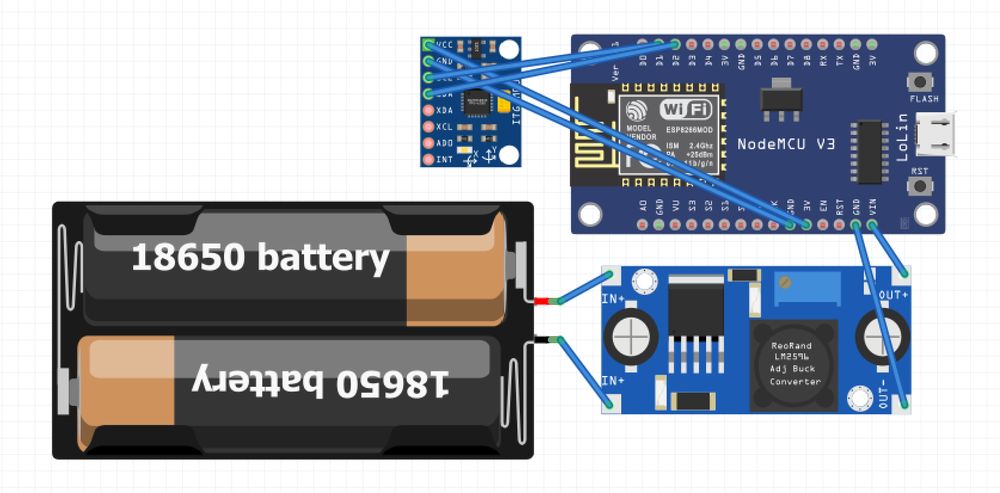
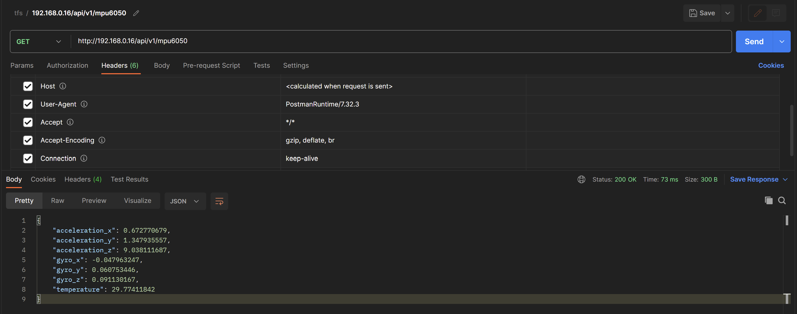

# Dob-Pointer

*(english below)*

> Para que se conecte a tu red wifi, cambia el archivo src/config/wifi.config.cpp con los datos de tu red wifi

# Descripción del Proyecto

Este proyecto consiste en un dispositivo basado en el microcontrolador **ESP8266** que utiliza el sensor **MPU6050** para medir la aceleración y la velocidad angular en tres ejes (X, Y, Z). Los datos obtenidos por el sensor se exponen a través de una **API HTTP** para que puedan ser consultados por otros dispositivos o aplicaciones.

El objetivo final es desarrollar un cliente para ordenador o móvil, capaz de leer los datos del acelerómetro, y mostrar los cambios de movimiento en un mapa estelar (previa calibración) para saber a qué zona del cielo estamos apuntando. Para esto, la caja con el circuito debe estar fijada en la parte trasera del espejo primario del telescopio. Aunque debido a la modudaridad del proyecto, este componente en concreto puede usarse para otros proyectos con diferentes fines.

# Componentes y Funcionalidad

**Sensor MPU6050**: Es un módulo que integra un acelerómetro y un giroscopio de 3 ejes en un solo chip. El acelerómetro mide la aceleración lineal y la gravedad en los ejes X, Y y Z, mientras que el giroscopio mide la velocidad angular en los mismos ejes.

**WiFi y NTP**: El dispositivo se conecta a una red WiFi utilizando las credenciales proporcionadas en un archivo de configuración (wifi.config.h). Además, sincroniza su hora utilizando el servicio NTP (Network Time Protocol) para obtener la hora y fecha actualizada.

**HTTP Server**: Se implementa un servidor web en el ESP8266 utilizando la biblioteca ESP8266WebServer. El servidor expone una API HTTP en la ruta /api/v1/mpu6050 que permite a los clientes obtener los datos del sensor en formato JSON.

**MDNS**: Se utiliza el servicio MDNS (Multicast DNS) para asignar un nombre de dominio local al dispositivo, lo que permite a otros dispositivos en la red acceder a él mediante un nombre personalizado (por ejemplo, https://mi-dispositivo.local).

# Funcionamiento

Al iniciar el dispositivo, se establece la conexión WiFi utilizando las credenciales proporcionadas en el archivo de configuración.

Una vez conectado a la red, se sincroniza la hora utilizando el servicio NTP para asegurarse de que los datos del sensor estén marcados con la hora correcta.

El sensor MPU6050 se inicializa y se configura con un rango específico para el acelerómetro y el giroscopio.

Se inicia el servidor web y comienza a escuchar solicitudes HTTP en la ruta /api/v1/mpu6050.

Cuando un cliente realiza una solicitud GET a la ruta mencionada, el servidor lee los datos actuales del sensor MPU6050.

Los datos de aceleración y velocidad angular se recopilan y se empaquetan en un objeto JSON.

El servidor responde al cliente con los datos del sensor en formato JSON.

Adicionalmente, el dispositivo se anuncia en la red local mediante MDNS, lo que permite a otros dispositivos encontrarlo fácilmente utilizando el nombre del dominio local asignado.

> to connect to your wifi network, change the file src/config/wifi.config.cpp with the data of your wifi network

# Project Description
This project consists of a device based on the **ESP8266** microcontroller that utilizes the **MPU6050** sensor to measure acceleration and angular velocity in three axes (X, Y, Z). The data obtained from the sensor is exposed through an **HTTP API** to be queried by other devices or applications.

The ultimate goal is to develop a client for computers or mobile devices, capable of reading accelerometer data and displaying motion changes on a star map (after calibration) to determine the region of the sky being pointed at. For this purpose, the box containing the circuit must be fixed to the back of the telescope's primary mirror. However, due to the modularity of the project, this specific component can be used for other projects with different purposes.

# Components and Functionality
**MPU6050 Sensor**: It is a module that integrates a 3-axis accelerometer and gyroscope into a single chip. The accelerometer measures linear acceleration and gravity in the X, Y, and Z axes, while the gyroscope measures angular velocity in the same axes.

**WiFi and NTP**: The device connects to a WiFi network using the credentials provided in a configuration file (wifi.config.h). It also synchronizes its time using the NTP (Network Time Protocol) service to obtain the current time and date.

**HTTP Server**: A web server is implemented on the ESP8266 using the ESP8266WebServer library. The server exposes an HTTP API at the /api/v1/mpu6050 route that allows clients to retrieve sensor data in JSON format.

**MDNS**: The MDNS (Multicast DNS) service is used to assign a local domain name to the device, allowing other devices on the network to access it using a custom name (e.g., https://my-device.local).

# Operation
Upon starting the device, it establishes a WiFi connection using the credentials provided in the configuration file.

Once connected to the network, it synchronizes the time using the NTP service to ensure that the sensor data is timestamped correctly.

The MPU6050 sensor is initialized and configured with specific ranges for the accelerometer and gyroscope.

The web server is started, and it begins listening for HTTP requests at the /api/v1/mpu6050 route.

When a client makes a GET request to the mentioned route, the server reads the current data from the MPU6050 sensor.

The acceleration and angular velocity data are collected and packaged into a JSON object.

The server responds to the client with the sensor data in JSON format.

Additionally, the device announces itself on the local network using MDNS, allowing other devices to easily discover it using the assigned local domain name.

